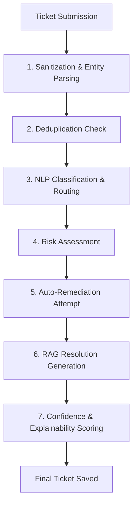

# Implementation Plan - Enterprise Service Desk Backend (Aligned with Agentic AI Support)

This implementation plan outlines the backend architecture for the Enterprise Service Desk Agent. It aligns with the multi-agent architecture found in the reference repository, implementing a robust, state-of-the-art **FastAPI** + **MongoDB** service featuring a 7-step agentic orchestrator pipeline, dynamic Google Gemini chat capabilities, and comprehensive user/ticket management.

---

## Tech Stack & Dependencies
- **FastAPI**: Main web framework.
- **Motor**: Asynchronous Python driver for MongoDB.
- **Pydantic v2**: For request/response schemas and settings.
- **PyJWT & Passlib[bcrypt]**: Security, hashing, and token validation.
- **PyOTP**: For TOTP Multi-Factor Authentication.
- **google-generativeai**: SDK to access Google Gemini models (`gemini-2.5-flash` or `gemini-1.5-flash`) for NLP, chat, classification, and resolution generation.
- **scikit-learn**: Used for TF-IDF based vectorization and cosine similarity in ticket deduplication (local, fast, and does not require loading heavy 1.5GB HuggingFace models on start).
- **WebSockets**: For real-time, low-latency chatbot communication and live notifications.

---

## User Review Required

> [!IMPORTANT]
> **Key Architectural Decisions & Reference Repository Alignment:**
> 1. **Deduplication Strategy**: We will implement a fast TF-IDF and Cosine Similarity checking engine on ticket creation. This matches the repository's ticket deduplication flow without requiring huge HuggingFace model downloads, making it fast and resource-efficient.
> 2. **AI Engine Integration**: We will utilize the official Google Gemini API (via `google-generativeai`) to handle dynamic chat, intent categorization, risk assessment, and RAG resolution generation. We will supply a fallback rule-based analyzer in case no Gemini API key is configured.
> 3. **Remediation & Password Reset**: The reference repository communicates with an external app (Web_Auth) to verify and trigger password resets. We will support this integration natively in our `password_reset_service.py` via HTTP requests, with a simulated/mock local handler for easy local development.
> 4. **MFA Flow**: High-security JWT authentication requiring a secondary code check (either TOTP Authenticator app or simulated email OTP) if MFA is enabled.

---

## The 7-Step Agentic Pipeline Flow

When a user submits a ticket, the `OrchestratorService` runs the following pipeline:



1. **Sanitization & Entity Parsing**: Clean input text (stripping SQL injection and PII) and extract systems, error codes, and tried steps.
2. **Deduplication Check**: Vectorize the new ticket using TF-IDF and compare against open tickets. If similarity > 0.78, link the ticket to the master incident and set status to `linked`.
3. **NLP Classification & Routing**: Classify the category (VPN, Email, Software, Hardware, Security, HR) and assign routing to the matching team (e.g., Network Team, Messaging Team).
4. **Risk Assessment**: Estimate security and business risk. Outages and suspected breaches scale priority to `critical` and flag for urgent escalation.
5. **Auto-Remediation Attempt**: If the issue is a password reset and `allowAiPasswordReset` is true, trigger a password reset via the integration service and set the ticket to resolved with the temporary credential.
6. **RAG Resolution**: Search KB articles matching the topic. Feed matched articles as context to Gemini to generate a customized, step-by-step resolution.
7. **Explainability & Confidence**: Attach confidence maps and explanation notes to the ticket history for auditor transparency.

---

## Database Collections

### 1. `users`
Profiles, roles (Employee, Agent, Manager, Admin), credential hashes, MFA status, login lockouts (5 failed attempts lock for 15 minutes).

### 2. `tickets`
Ticketing fields including status workflows (Open -> Assigned -> In Progress -> Resolved -> Closed), categorization, priority, assignment, attachments, and the outputs of the 7 agentic stages.

### 3. `kb_articles`
Categorized articles with text content and keyword tags.

### 4. `chat_sessions`
Message lists for dynamic AI chatbot sessions (Context-aware conversations, suggested solutions, and ticket creation triggers).

### 5. `notifications`
User notifications (unread flag, websocket push triggers).

### 6. `system_counters`
Year-based sequential ticket numbers (`TKT-YYYY-XXXXX`).

---

## Directory Structure (FastAPI App)

```
backend/
├── app/
│   ├── __init__.py
│   ├── main.py
│   ├── config.py
│   ├── database.py
│   ├── models/
│   │   ├── user.py
│   │   ├── ticket.py
│   │   ├── kb.py
│   │   └── notification.py
│   ├── schemas/
│   │   ├── auth.py
│   │   ├── ticket.py
│   │   ├── kb.py
│   │   └── chat.py
│   ├── routers/
│   │   ├── auth.py
│   │   ├── tickets.py
│   │   ├── kb.py
│   │   ├── chat.py
│   │   └── analytics.py
│   ├── services/
│   │   ├── auth_service.py
│   │   ├── orchestrator.py      # Main pipeline executor
│   │   ├── ai_service.py        # Gemini client interface
│   │   ├── dedup_service.py     # TF-IDF similarity matcher
│   │   ├── kb_service.py        # KB searcher
│   │   ├── remediation_service.py # Password resets & mock actions
│   │   └── notification_service.py # Websockets & SMTP
│   └── utils/
│       ├── security.py
│       └── mfa.py
├── requirements.txt
├── .env.example
├── .env
├── seed.py                      # Seeds initial users & KB articles
└── tests/
    ├── conftest.py
    ├── test_auth.py
    └── test_orchestrator.py
```

---

## Verification Plan

### Automated Tests
```bash
pytest tests/
```

### Manual Verification
1. Run `python seed.py` to create seed data.
2. Launch backend using `uvicorn app.main:app --reload`.
3. Verify interactive API docs at `http://localhost:8000/docs`.
4. Test WebSocket chatbot connections using a tool or client.
5. Create a duplicate incident and verify it is auto-linked and categorized correctly.
